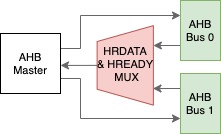
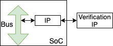
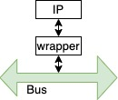
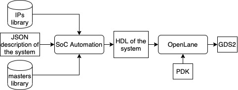
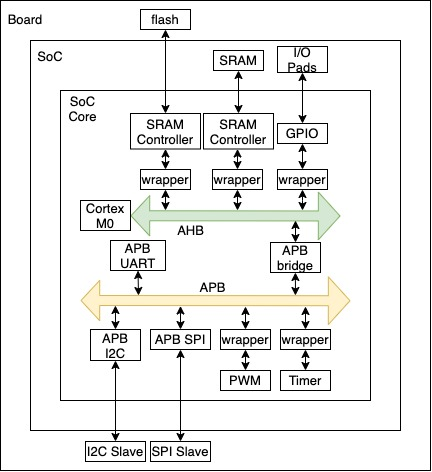

# SoCGen

A truly no man in the loop.<br><br> 
This program automates SoC design through taking JSON input and generating verilog HDL for the SoC. 
We're working on the integration with [OpenLane](https://github.com/efabless/openlane) to generate the final GDS2. 
Currently we support AMBA AHB for the high-speed (main) bus and APB for the low speed peripherals bus. 

## Getting Started

This instruction will get you a copy of the project up and running on your local machine for development and testing purposes.
```shell
git clone https://github.com/habibagamal/SoC_automation
```
If you need help with how to run the program
```shell
node ./src/sys_gen.js -help 
```
To generate the full SoC .v files
```shell
node ./src/sys_gen.js -soc <soc.json> -mastersLib <masters_lib.json> -IPlib <ip_lib.json> -subsystem <subsystem.json> -outDir <output directory> 
```
- Omit any fields you don't need in the above command.
- If there are no subsystems or real masters, you can ommit "-subsystem <subsystem.json>" or "-mastersLib <masters_lib.json>", respectively, from the command.

## Expected input
For instructions on how to write the JSON file for: 
- the masters library: [check this](JSON_format_doc/masters)
- the IPs library: [check this](JSON_format_doc/IPs)
- the system: [check this](JSON_format_doc/SoC)
- the subsyetem: [check this](JSON_format_doc/subsystems)

## Directory structure
- [systems](./systems): contains soc examples
- [IPs](./IPs): contains JSON for IPs library and verilog files for open-source IPs
- [masters](./masters): contains JSON for masters library and master-related files
- [src](./src): contains source code
- [JSON_format_doc](./JSON_format_doc): contains documentation for JSON format
- [Images](./Images): contains images used in README

## Memory Address Sketch
#### For AHB

--------------------------
#### For APB


## Currently supported features
- Having multiple masters (tested on dummy masters)<br>

- Having multiple buses<br>

- Using created and open source verification IPs for testing<br>

- Using IPs that are not APB or AHB compatible<br>

- Auto-generating self-checking testbench

## Flow


## System Block Diagram
This diagram represents [this example](./systems/CM0/Raptor)<br>


Go [here](https://developer.arm.com/) to download Arm Cortex M0, M3 files<br>
Check this [poster](https://drive.google.com/file/d/1GBd_jf6H-ud2rCmiS8y-bdfOldHAYiDl/view?usp=sharing) and [video](https://www.youtube.com/watch?v=QFSN9ta08jg) presented in DAC 2020 Young Fellowship Program about the project

## Used Projects
- Arbiter taken from [here](https://github.com/adki/gen_amba)

## To-do 
- Datasheet generation
- Hardening using openLane

## Authors
* **Amr Gouhar** [agorararmard](https://github.com/agorararmard)
* **Habiba Gamal** [habibagamal](https://github.com/habibagamal)
* **Mohamed Shalan** [shalan](https://github.com/shalan)


